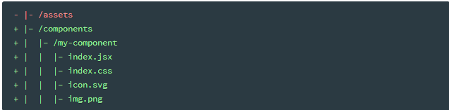

# part 1

## 1.0 使用Sass作为css预处理器

[参考Sass](https://www.sass.hk/guide/)

* 导入方法
    * import './color.sass'
* 将css当中比较繁琐的规则都省去,提高开发效率比如:
    * 通过缩进的方式替代,css中的{}
    * 不用写引号以及逗号

## koa 与 express 


```js
var express = require('express')
var app = express()

// 当前的执行结果是 mark saved done

var mid = function (req, res, next) {
    req.body = 'mark'
    next()
    res.send(req.body + 'done')
}
    app.use(mid)
    app.use(function(req, res, next) {
        req.body += ' saved'
        next()
    })

app.listen(3000)
```

```js
var express = require('express')
var app = express()

// 当前的执行结果是 mark saved done

var asyncIO = function(cb) {
    setTimeout(() => {
        cb()
    }, 500)
}
var mid = function (req, res, next) {
    req.body = 'mark'
    next()
    res.send(req.body + 'done')
}
    app.use(mid)
    app.use(function(req, res, next) {
        // 在中间件中,执行了异步的动作,可以是读取硬盘的文件,或者远程api的调用,或者是定时任务
        // 使用callback控制流程的控制权,当异步结束后将控制权交回顺序执行
        // 这里有个问题就是,当回调层次多于3级 或者有并发异步,这种回调的层次就会让测试,维护变得困难
        // 特别是异常处理,都把异常交由下一层处理
        asyncIO (function (){
            req.body += ' saved'
        })
        next()
    })
app.listen(3000)

// 让异步扁平
```

## 使用koa重复上面的代码

[Generator 函数的含义与用法](http://www.ruanyifeng.com/blog/2015/04/generator.html)

1. 什么是异步?
    就是将一个任务分成两段,先执行第一段，然后转而执行其他任务，等做好了准备，再回过头执行第二段.
什么是回调函数

JavaScript 语言对异步编程的实现，就是回调函数,所谓回调函数，就是把任务的第二段单独写在一个函数里面，等到重新执行这个任务的时候，就直接调用这个函数。

也就是将异步的两段都写入一个调用当中,第一个参数是第一段,第二个参数是第二段要执行的内容(是以回调函数的形式写入的,而回调函数的使用者则是,当前这个调用)
**简单来说 一般有两个参数 执行两段内容**
1. 参数1 第一段执行内容
2. 参数2 函数
 
* 这有个问题为什么必须是函数呢?
    因为调用者在执行完第一段之后,需要将结果返回,能调用的也只能是一个函数,只有函数才能被调用

一个新技术的诞生必然是为了解决旧技术的不足之处


## 一、异步函数

## 二、promise

## 三、协程

[Generator 函数的语法 - ECMAScript 6入门](http://es6.ruanyifeng.com/#docs/generator)

```js
function* helloworldGenerator() {
    yield 'hello'
    yield 'world'
    return 'ending'
}
var hw = helloworldGenerator()
console.log(hw.next())
console.log(hw.next())
console.log(hw.next())
console.log(hw.next())
// { value: 'hello', done: false }
// { value: 'world', done: false }
// { value: 'ending', done: true }
// { value: undefined, done: true }
```

* 上面的函数是一个generator函数
* 函数定义了三种状态即,hello ,world, return(返回状态,结束执行)
* Generator函数与普通函数返回的不同之处在于,返回的不是结果,而是一个内部状态的指针对象(Iterator object)
* 必须调用next()方法使得指针移向下一个状态.每次调用next方法内部指针就从函数头部或上一次停下来的地方开始执行
* 直到遇到下一个yield表达式（或return语句）为止。换言之，Generator 函数是分段执行的，yield表达式是暂停执行的标记，而next方法可以恢复执行。
* value表示分段执行后的返回值,done表示是否执行完毕
* yield是Generator函数内部暂停执行的标记


Generator 函数可以不用yield表达式，这时就变成了一个单纯的暂缓执行函数

```js
function* f() {
    console.log('go...')
}
const gen = f()
setTimeout(() => {
    gen.next()
}, 1000);
```

* 函数f如果是普通函数，在为变量generator赋值时就会执行。但是，函数f是一个 Generator 函数，就变成只有调用next方法时，函数f才会执行。
* yield表达式只能用在 Generator 函数里面，用在其他地方都会报错

```js
(function (){
  yield 1;
})()
// SyntaxError: Unexpected number
//在一个普通函数中使用yield表达式，结果产生一个句法错误。

var arr = [1, [[2,3], 4], [5, 6]]

var flat = function* (a){
    a.forEach(function(item) {
        if (typeof item !== 'number') {
            yield* flat(item)
        }else{
            yield item
        }
    })
}

for (var f of flat(arr)){
    console.log(f);
}


var arr = [1, [[2,3], 4], [5, 6]]

var flat = function* (a){
    for(let i = 0; i<a.length; i++) {
     let item = a[i]
        if (typeof item !== 'number') {
            yield* flat(item)
        }else{
            yield item
        }
    }
}
for (var f of flat(arr)){
    console.log(f);
}
```

* 在一个普通函数中使用yield表达式，结果产生一个句法错误。


```js
var koa = require('koa')
var app = new koa()

var asyncIO = function () {
    return new Promise( function(resolve) {
        setTimeout(() => {
            resolve()
        }, 500);
    })
}

var mid = function() {
    return function* (next){
        this.body = 'mark'
        yield next
        this.body += ' done'
    }
}

app.use(mid)
app.use(function* (next) {
    yield asyncIO
    this.body = ' saved'
    yield next
})

app.listen(3000)
```


```js
const fs = require('fs')

const readFile = function (fileName) {
    return new Promise (function (resolve,reject) {
        fs.readFile(fileName, function (error, data){
            if (error) return reject(error)
            resolve(data)
        })
    })
}

const gen = function* () {
    const f1 = yield readFile('E:/soft/temp/index.html')
    const f2 = yield readFile('E:/soft/temp/bitcoin-on-nodejs.pdf')
    console.log(f1.toString);
    console.log(f2.toString);
}

gen().next()
gen().next()
gen().next()
```

```js
const fs = require('fs')
const readFile = function (fileName) {
    return new Promise (function (resolve,reject) {
        fs.readFile(fileName, function (error, data){
            if (error) return reject(error)
            resolve(data)
        })
    })
}

const gen = async function () {
    const f1 = await readFile('E:/soft/temp/index.html')
    const f2 = await readFile('E:/soft/temp/bitcoin-on-nodejs.pdf')
    console.log(f1.toString);
    console.log(f2.toString);
}
gen()
```

```js
const koa = require('koa')
const app = new koa()

const asyncIO = () => {
    return new Promise(resolve => setTimeout(resolve, 500))  
}
const mid = () => async (ctx, next) => {
    ctx.body = 'mark'
    await next()
    ctx.body = ctx.body + ' done'
}

app.use(mid())
app.use(async (ctx, next) => {
    await asyncIO()
    ctx.body += ' saved'
    await next()
})
app.listen(3000)
```


将小程序的三个页面写在一个页面当中,并使用vue风格开发小程序

使用模版语法

```html
<template lang="pug"></template>
```

集成webpack

[起步](https://doc.webpack-china.org/guides/getting-started/)

npx webpack src/index.js --output dist/bundle.js


```js
import _ from 'lodash'
import './style.css'

function component() {
    var element = document.createElement('div');
  
     // lodash 是由当前 script 脚本 import 导入进来的
    element.innerHTML = _.join(['Hello', 'webpack'], ' ');
    element.classList.add('hello')
    return element;
  }
  document.body.appendChild(component());
```

```js
const path = require('path')

module.exports = {
    entry: './src/index.js',
    output: {
        filename: 'bundle.js',
        path: path.resolve(__dirname, 'dist')
    },
    module: {
        rules: [
            {
                test: /\.css$/,
                use: [
                    'style-loader',
                    'css-loader'
                ]
            }
        ]
    }
}
```
使用webpack的style-loader css-loader


* 可以在js中直接使用import 将css 文件引入,而不是像以前那样自己在html页面中通过link的方式引入,改变了程序员开发流程,如果结合vue(将css script template,写在一个页面里又不相互影响)
* 

处理图片使用 file-loader

```js
  {
                test: /\.(png|svg|jpg|gif)$/,
                use: [
                    'file-loader'
                ]
            }
```

无需依赖于含有全部资源的 /assets 目录，而是将资源与代码组合在一起。例如，类似这样的结构会非常有用：



这种配置方式会使你的代码更具备可移植性，因为现有的统一放置的方式会造成所有资源紧密耦合在一起。假如你想在另一个项目中使用 /my-component，只需将其复制或移动到 /components 目录下。只要你已经安装了任何扩展依赖(external dependencies)，并且你已经在配置中定义过相同的 loader，那么项目应该能够良好运行。
[全局资源](https://doc.webpack-china.org/guides/asset-management/#全局资源)

HtmlWebpackPlugin 自动将构建生成的index.html

* bundle 会自动添加到 html 中

## 清理 /dist 文件夹

npm install clean-webpack-plugin --save-dev


## 使用 source map

JavaScript 提供了 source map 功能，将编译后的代码映射回原始源代码,便于查找错误

## 选择一种开发模式

每次要编译代码时，手动运行 npm run build 就会变得很麻烦。

webpack 中有几个不同的选项，可以帮助你在代码发生变化后自动编译代码：

1. webpack's Watch Mode
2. webpack-dev-server
3. webpack-dev-middleware


## 使用观察模式

```js
package.json
  {
    "name": "development",
    "version": "1.0.0",
    "description": "",
    "main": "webpack.config.js",
    "scripts": {
      "test": "echo \"Error: no test specified\" && exit 1",
+     "watch": "webpack --watch",
      "build": "webpack"
    },
```
npm run watch

* 唯一的缺点是，为了看到修改后的实际效果，你需要刷新浏览器。如果能够自动刷新浏览器就更好了，可以尝试使用 webpack-dev-server，恰好可以实现我们想要的功能。

### 使用 webpack-dev-server

webpack-dev-server 为你提供了一个简单的 web 服务器，并且能够实时重新加载(live reloading)。

npm install --save-dev webpack-dev-server

```js
module.exports = {
    mode: 'development',
    entry: {
        app: './src/index.js',
        print: './src/print.js'
    },
    devtool: 'inline-source-map',
+    devServer: {
+       contentBase: './dist'
+    },
    plugins: []
```

以上配置告知 webpack-dev-server

* 在 localhost:8080 下建立服务，
* 将 dist 目录下的文件，作为可访问文件。

添加一个 script 脚本，可以直接运行开发服务器(dev server)：

        "start": "webpack-dev-server --open"

## 使用 webpack-dev-middleware

webpack-dev-middleware 是一个容器(wrapper)，它可以把 webpack 处理后的文件传递给一个服务器(server)。 webpack-dev-server 在内部使用了它，同时，它也可以作为一个单独的包来使用，以便进行更多自定义设置来实现更多的需求。接下来是一个 webpack-dev-middleware 配合 express server 的示例。

npm install --save-dev express webpack-dev-middleware


## 模块热替换